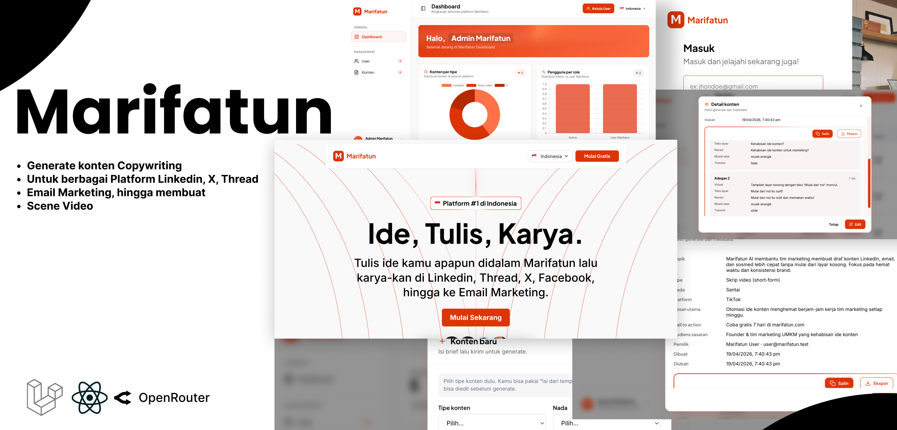

# Marifatun Backend

<p align="center">
  
</p>

## Deskripsi

Marifatun merupakan kosakata yang diambil dari Arab yang mengartikan Pengetahuan, dengan tujuan untuk melakukan generating copywriting konten yang dapat di share di LinkedIn, X, Thread, Facebook, hingga ke Email Marketing. Dan juga melakukan scripting scenes untuk membuat Video.

## Instalasi

Pastikan di komputer lokal sudah terpasang:

- **Laravel** versi **v13**
- **PHP** versi **8.4**

Langkah menjalankan project:

```bash
cd marifatun_backend
composer install
cp .env.example .env
php artisan key:generate
php artisan storage:link
php artisan migrate (Pastikan username, password, nama database sudah terbuat di database mysql lokal pc/laptop masing-masing)
php artisan db:seed
php artisan serv
```

Buka di browser: [http://localhost:8000/](http://localhost:8000/)
